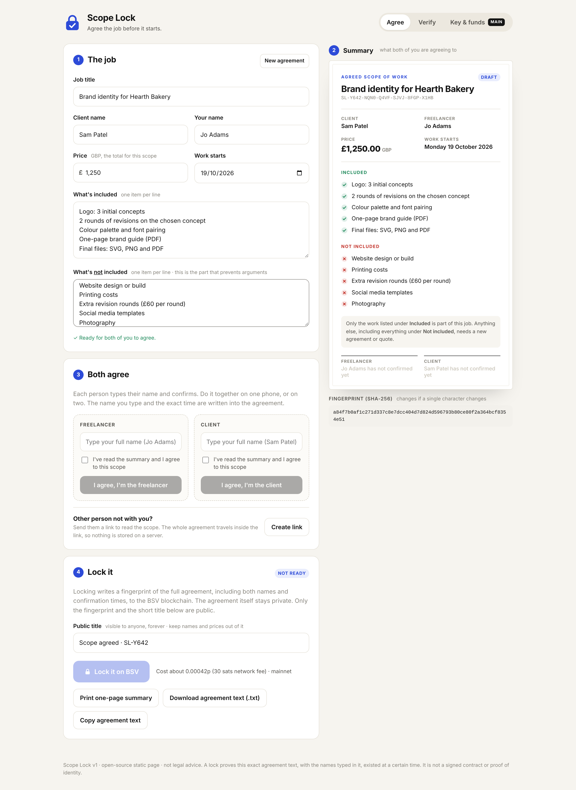

# Scope Lock — v1

Agree the job before it starts. A freelancer and a client write down what's included, what's
**not** included, the price and the start date. Both of them confirm it, and a **SHA-256
fingerprint of the full agreement** (including both typed names and confirmation times) is
written to the BSV blockchain. If someone later says "I thought that was included", there is a
dated, unchangeable record of what you both agreed.

Live: https://sargefury1972-pixel.github.io/scope-lock/



## How it works

1. **The job.** Fill in the job title, client name, your name, price (GBP), start date, what's
   included and what's not included (one item per line).
2. **Summary.** A clean, readable summary updates as you type.
3. **Both agree.** Each person types their name, ticks the box and confirms. The name and the
   exact time are recorded. Once anyone has agreed, the terms are frozen. Changing them clears
   both confirmations and gives the agreement a new reference.
   - **Not in the same room?** Click **Create link** and send it by email, WhatsApp or any app.
     The whole agreement travels inside the link's `#` part, which browsers never send to the
     server, so nothing is stored online. The other person confirms and sends a link back.
4. **Lock it.** Writes the fingerprint to BSV for about **30 satoshis, roughly 0.0004p**. You can
   lock with one confirmation and lock again once the other person confirms. Each lock gets a
   txid and a WhatsOnChain link.
5. **Verify.** Paste the agreement text (or a share link, or open the `.txt`) and a txid to see
   **match** or **no match**.
6. **Print.** Prints a one-page A4 summary with the fingerprint, txid and a QR code to the
   transaction.

## What goes on-chain

One unspendable output: `OP_FALSE OP_RETURN "SCOPELOCK" "1" <32-byte SHA-256> "<public title>" "<ISO time>"`.

Only the fingerprint, the short public title (default `Scope agreed · SL-XXXX`) and the lock time
are public. The agreement text includes a random 120-bit reference, so nobody can guess the
contents from the fingerprint.

The fingerprint is SHA-256 of the UTF-8 agreement text. Line endings are normalised to `\n`,
trailing spaces are removed and there's no final newline. You can check it without this site:
save the text, run `shasum -a 256`, and compare the result with the 32 bytes after
`SCOPELOCK` `1` on any BSV explorer.

## Paying for locks

Open **Key & funds**, then click **Create locking key**. Click **Download backup** straight away,
then send a few pence of BSV to the address. 100,000 sats (about 1.4p) covers roughly 3,000 locks.
This key is separate from the Proof of Design key and from your wallet. It is a hot key stored in
this browser, so keep only pennies on it. **Withdraw all** sends the balance back to your wallet.
Testnet is available for practice.

Optional service fee: set `serviceFee` in `js/config.js` to charge a few sats per lock, paid to
your own address.

## Limitations (please read)

- **Not a signed contract and not legal advice.** A lock proves this exact text, including the
  typed names, existed by the block time. It doesn't prove who typed each name. For bigger jobs,
  use a proper contract too.
- **Keep the agreement text.** The blockchain only holds the fingerprint. Keep the share link, the
  `.txt` or the printout. Without the exact text, there's nothing to verify against.
- **Byte-exact.** Change a single character and it won't match. That is the point.
- **Times.** Confirmation times come from each person's device clock. The block time is the
  authoritative time.
- **Shared links can be read by anyone who has them.** Only send them to the other person.
- Balances and verification use the free WhatsOnChain API. Broadcasts go to GorillaPool ARC, with
  WhatsOnChain as a fallback.

## Files

```
index.html, styles.css
js/config.js      settings (network, optional service fee, endpoints)
js/agreement.js   agreement text, fingerprint, share-link encoding (no DOM, unit-tested)
js/core.js        OP_RETURN build/parse + tx building (from Proof of Design, prefix SCOPELOCK)
js/print.js       summary document + printable one-page A4
js/app.js         UI + WhatsOnChain/ARC glue
vendor/           @bsv/sdk 3.2.0 subset (IIFE) + qrcode-generator
```
